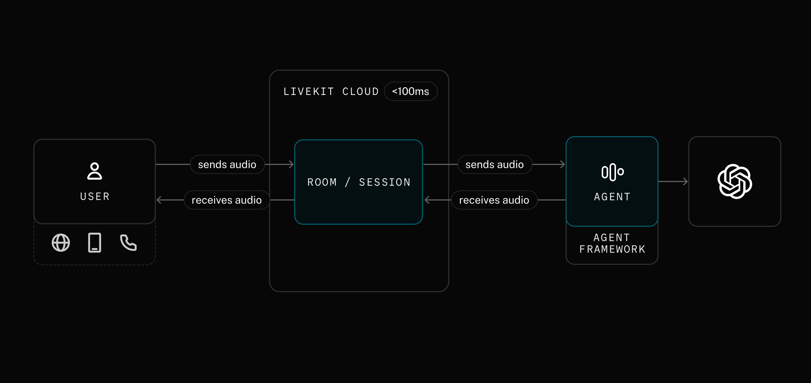
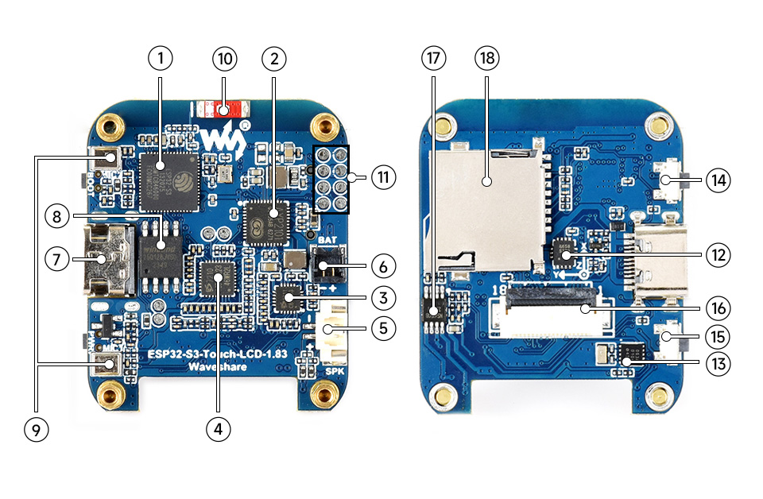
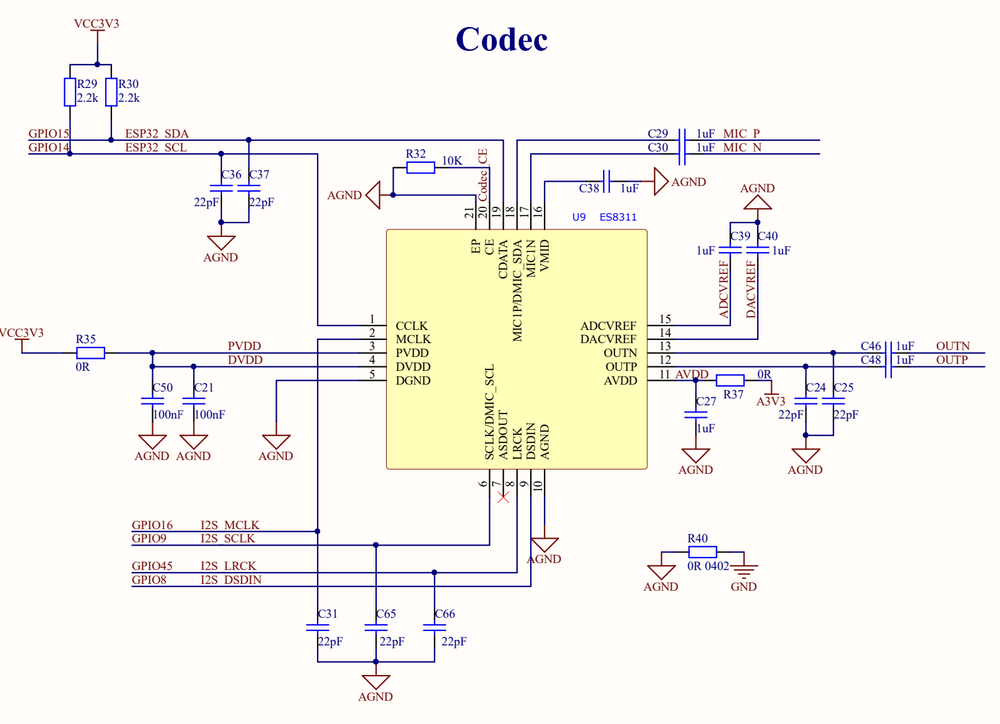
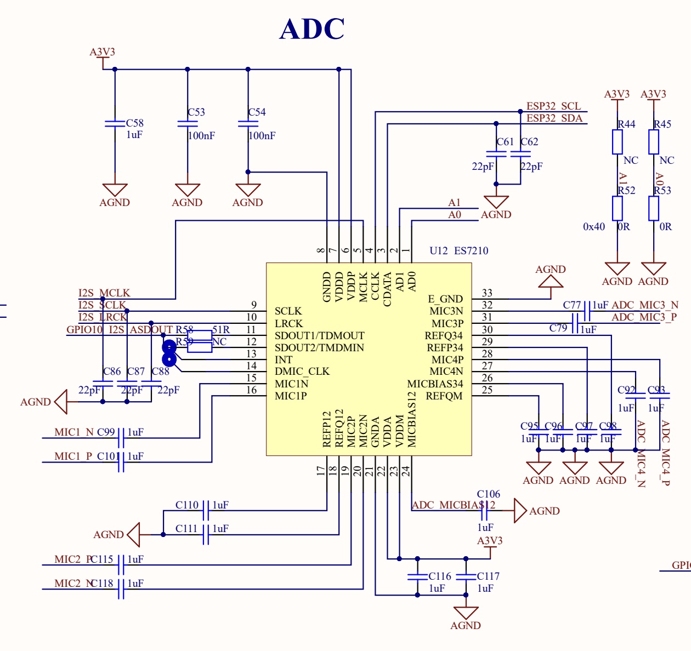
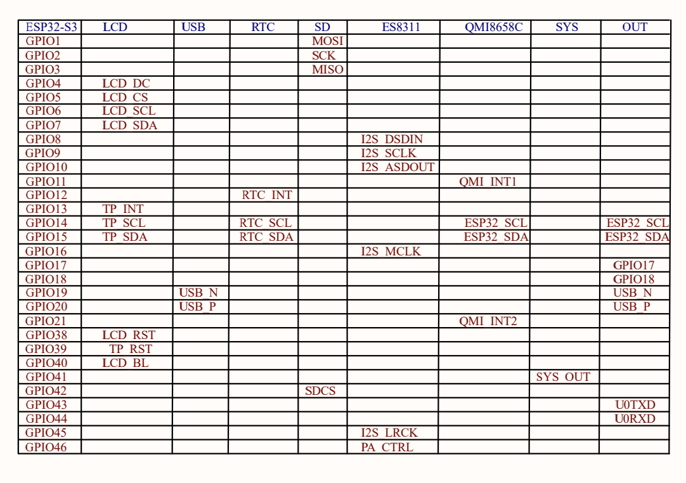
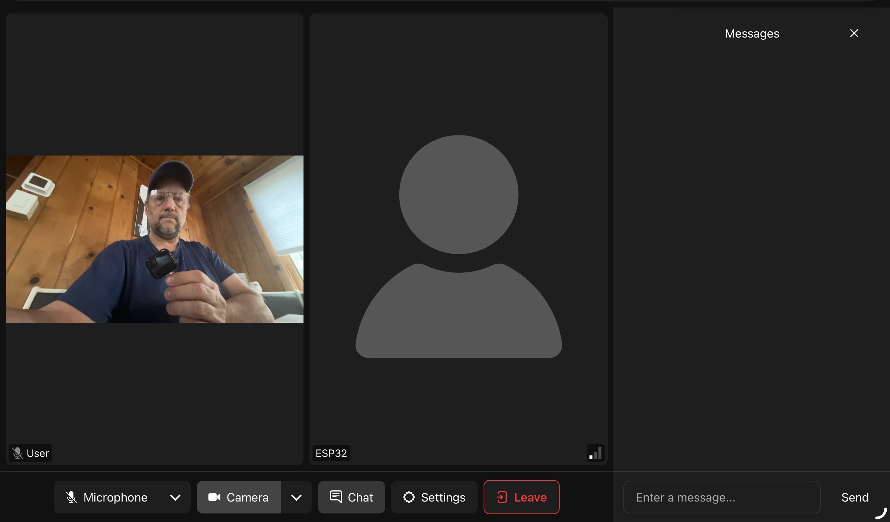

# Building a voice agent frontend on custom ESP32 hardware

The ESP32 is one of the most accessible ways to build a hardware frontend for [LiveKit Agents](https://docs.livekit.io/agents/). An ESP32-S3 with a microphone and speaker can join a LiveKit room, stream audio to a cloud-hosted agent, and play back the agent's response — all over WiFi with sub-100ms transport latency.



In the diagram above, the **USER** box represents any LiveKit client — a browser, a mobile app, a phone call, or an **ESP32**. Your ESP32 is just another client: it connects to a LiveKit room the same way a web browser or mobile app would. The agent on the other side of that room sends and receives audio without knowing (or caring) what kind of device it's talking to. This means you can build a dedicated hardware voice interface for any LiveKit agent — a smart speaker, a robot, an intercom — using the same agent backend you'd use for a web app.

The [LiveKit ESP32 SDK](https://components.espressif.com/components/livekit/livekit) ships with [examples](https://components.espressif.com/components/livekit/livekit/examples) for reference boards like the ESP32-S3-BOX-3 and ESP-Korvo-2. But if you're building a product on your own hardware — or evaluating on a dev board that isn't in the examples — you need to adapt the SDK to your pin configuration and audio codecs.

This post walks through the full process: read the schematic, map the pins, initialize the audio hardware, and get the ESP32 connected to a LiveKit room where it can talk to an agent. The [Waveshare ESP32-S3-Touch-LCD-1.83](https://www.waveshare.com/esp32-s3-touch-lcd-1.83.htm) serves as a concrete example. It's affordable (~$16), widely available, and uses the ES8311 + ES7210 codec pair — the same audio front-end found on Espressif's own reference boards. Its compact form factor and battery header also make it a good candidate for embedding in your own product enclosure. The board has a published BSP, but you'll configure everything manually here to see how it works on *any* board.

## What you'll need

- [Waveshare ESP32-S3-Touch-LCD-1.83](https://www.waveshare.com/esp32-s3-touch-lcd-1.83.htm) (or your own ESP32-S3 board with I2S audio).
- A small speaker with MX1.25 connector (the board used here has a speaker connected already).
- ESP-IDF 5.4 or later ([install guide](https://docs.espressif.com/projects/esp-idf/en/stable/esp32s3/get-started/index.html)).
- A [LiveKit Cloud](https://cloud.livekit.io) account (free tier works) or a self-hosted LiveKit server.
- USB-C cable.
- Python 3 with the `livekit-api` package (`pip install livekit-api`) — for generating tokens.

## Meet the board



| # | Component | Description |
|---|-----------|-------------|
| 1 | ESP32-S3R8 | Dual-core SoC, 240 MHz, 8 MB PSRAM |
| 2 | AXP2101 | Power management IC (controls codec power rails) |
| 3 | ES8311 | Audio DAC — drives the speaker |
| 4 | ES7210 | Audio ADC — captures from the dual-mic array |
| 5 | MX1.25 speaker header | Connect an external speaker here |
| 6 | Battery header | 3.7 V lithium battery (optional) |
| 7 | USB-C port | Flashing and serial monitor |
| 8 | 16 MB NOR flash | Program and data storage |
| 9 | Dual microphone array | Two MEMS mics for voice capture and echo cancellation |
| 10 | Onboard antenna | 2.4 GHz WiFi and Bluetooth 5 LE |
| 17 | NS4150B amp | Class-D speaker amplifier (needs GPIO enable) |

> Callout numbers match the photo above. Components not listed (11-16, 18) are for the LCD, touch controller, TF card slot, and other peripherals not needed for audio.

The ES8311 + ES7210 codec pair is the same audio front-end used on the ESP32-S3-BOX-3 and Korvo-2 reference boards — well-supported drivers, proven AEC performance, and plenty of example code to reference. The only difference on this board is the GPIO pin assignments, which is exactly the problem you need to solve.

## Step 1: Extract pin assignments from the schematic

Download the [board schematic](https://files.waveshare.com/wiki/ESP32-S3-Touch-LCD-1.83/ESP32-S3-Touch-LCD-1.83-schematic.pdf) from the [Waveshare wiki](https://www.waveshare.com/wiki/ESP32-S3-Touch-LCD-1.83). You need to find three things: **I2S bus pins**, **I2C bus pins**, and **codec I2C addresses**.

### I2S bus — the audio data path

Open the **Codec** block in the schematic. The ES8311 (U9) has the I2S signals labeled on its pins:



- `GPIO16` → `I2S_MCLK` — master clock to both codecs
- `GPIO9` → `I2S_SCLK` — bit clock
- `GPIO45` → `I2S_LRCK` — word select (left/right clock)
- `GPIO8` → `I2S_DSDIN` — serial data *into* the ES8311 DAC (playback)

Now look at the **ADC** block for the ES7210 (U12):



The ES7210 shares the same clock lines and adds one more data pin:

- `GPIO10` → `I2S_ASDOUT` — serial data *out of* the ES7210 ADC (recording)

### I2C bus — codec control

Both codecs are configured over I2C. The schematic shows them sharing a bus:

- `GPIO14` → `ESP32_SCL`
- `GPIO15` → `ESP32_SDA`

This bus is shared with the touch controller, RTC, IMU, and PMU. Each device has a unique address, so they coexist without conflict.

### I2C addresses

The ES8311 CE pin is pulled low → 7-bit address **`0x18`**.
The ES7210 AD0 and AD1 pins are tied to ground → 7-bit address **`0x40`**.

### Speaker amplifier

The NS4150B class-D amplifier is enabled by `GPIO46` (`PA_CTRL`). If you don't drive this pin high, the speaker stays silent — a common gotcha.

### Cross-referencing with the GPIO table

The schematic includes a GPIO allocation table. Use it to verify:



### Pin summary

**I2S bus:**

| Signal | GPIO | Direction | Description |
|--------|------|-----------|-------------|
| `I2S_MCLK` | 16 | Out | Master clock to both codecs |
| `I2S_SCLK` | 9 | Out | Bit clock (BCLK) |
| `I2S_LRCK` | 45 | Out | Word select (WS) |
| `I2S_DSDIN` | 8 | Out | ESP32 → ES8311 (playback) |
| `I2S_ASDOUT` | 10 | In | ES7210 → ESP32 (recording) |

**I2C bus and addresses:**

| Signal/Device | GPIO / Address |
|---------------|----------------|
| `ESP32_SCL` | GPIO 14 |
| `ESP32_SDA` | GPIO 15 |
| ES8311 (DAC) | 7-bit `0x18` / 8-bit `0x30` |
| ES7210 (ADC) | 7-bit `0x40` / 8-bit `0x80` |
| AXP2101 (PMU) | 7-bit `0x34` |
| PA enable | GPIO 46 |

> **Watch out: 7-bit vs 8-bit I2C addresses.** The `esp_codec_dev` driver expects **8-bit (left-shifted) addresses** in `audio_codec_i2c_cfg_t.addr`. It internally right-shifts by 1 to get the 7-bit address. If you pass the raw 7-bit address from the datasheet (e.g. `0x18`), the driver talks to address `0x0C` and you'll get NACKs. Use the `ES8311_CODEC_DEFAULT_ADDR` (`0x30`) and `ES7210_CODEC_DEFAULT_ADDR` (`0x80`) macros.

## Step 2: Initialize the hardware

The SDK's reference examples use a `codec_board` component that reads board configs from a file. That works for supported boards but hides the initialization sequence. For custom hardware, it's more reliable to initialize each peripheral directly.

**The order matters: I2C → PMU → I2S → codecs.** The AXP2101 PMU controls the power rail that feeds the codecs. If you skip it, every I2C transaction to the codecs will NACK.

### 2a. I2C bus

```c
#define BOARD_I2C_SDA  GPIO_NUM_15
#define BOARD_I2C_SCL  GPIO_NUM_14

static esp_err_t init_i2c(void)
{
    i2c_master_bus_config_t cfg = {
        .clk_source = I2C_CLK_SRC_DEFAULT,
        .i2c_port   = I2C_NUM_0,
        .scl_io_num = BOARD_I2C_SCL,
        .sda_io_num = BOARD_I2C_SDA,
        .glitch_ignore_cnt = 7,
        .flags.enable_internal_pullup = true,
    };
    return i2c_new_master_bus(&cfg, &i2c_bus);
}
```

### 2b. AXP2101 PMU — power up the codecs

The AXP2101 (I2C address `0x34`) controls several voltage rails. The ES8311 and ES7210 are powered from **ALDO1** at 3.3 V. Set the voltage and enable the output:

```c
#define AXP2101_ADDR        0x34
#define AXP2101_LDO_ONOFF   0x90
#define AXP2101_ALDO1_VOLT  0x92

static esp_err_t init_pmu(void)
{
    i2c_device_config_t pmu_cfg = {
        .dev_addr_length = I2C_ADDR_BIT_LEN_7,
        .device_address  = AXP2101_ADDR,
        .scl_speed_hz    = 400000,
    };
    i2c_master_bus_add_device(i2c_bus, &pmu_cfg, &pmu_dev);

    // ALDO1 → 3.3 V: (3300 - 500) / 100 = 0x1C
    pmu_write_reg(AXP2101_ALDO1_VOLT, 0x1C);

    // Read-modify-write: enable ALDO1 (bit 0 of reg 0x90)
    uint8_t reg = AXP2101_LDO_ONOFF;
    uint8_t val = 0;
    i2c_master_transmit_receive(pmu_dev, &reg, 1, &val, 1, 1000);
    val |= 0x01;
    pmu_write_reg(AXP2101_LDO_ONOFF, val);

    vTaskDelay(pdMS_TO_TICKS(20));  // let the rail stabilize
    return ESP_OK;
}
```

> **Tip:** Not every board has a PMU gating codec power. But if you see NACKs during codec init on a board with an AXP2101 or similar PMIC, check whether the codec power rail needs to be explicitly enabled.

### 2c. I2S bus

The ES8311 (playback) uses standard I2S. The ES7210 (recording) uses TDM mode with 4 slots — one per microphone channel. Both share the same I2S port:

```c
#define BOARD_I2S_MCLK GPIO_NUM_16
#define BOARD_I2S_BCLK GPIO_NUM_9
#define BOARD_I2S_WS   GPIO_NUM_45
#define BOARD_I2S_DOUT GPIO_NUM_8
#define BOARD_I2S_DIN  GPIO_NUM_10

static esp_err_t init_i2s(void)
{
    i2s_chan_config_t chan_cfg = I2S_CHANNEL_DEFAULT_CONFIG(
        I2S_NUM_AUTO, I2S_ROLE_MASTER);
    chan_cfg.auto_clear = true;
    i2s_new_channel(&chan_cfg, &i2s_tx, &i2s_rx);

    // TX: standard mode for ES8311 playback
    i2s_std_config_t std_cfg = {
        .clk_cfg  = I2S_STD_CLK_DEFAULT_CONFIG(16000),
        .slot_cfg = I2S_STD_MSB_SLOT_DEFAULT_CONFIG(
                        32, I2S_SLOT_MODE_STEREO),
        .gpio_cfg = {
            .mclk = BOARD_I2S_MCLK,
            .bclk = BOARD_I2S_BCLK,
            .ws   = BOARD_I2S_WS,
            .dout = BOARD_I2S_DOUT,
            .din  = BOARD_I2S_DIN,
        },
    };
    i2s_channel_init_std_mode(i2s_tx, &std_cfg);

    // RX: TDM mode for ES7210 4-channel recording
    i2s_tdm_slot_mask_t slot_mask =
        I2S_TDM_SLOT0 | I2S_TDM_SLOT1 |
        I2S_TDM_SLOT2 | I2S_TDM_SLOT3;
    i2s_tdm_config_t tdm_cfg = {
        .clk_cfg  = I2S_TDM_CLK_DEFAULT_CONFIG(16000),
        .slot_cfg = I2S_TDM_PHILIPS_SLOT_DEFAULT_CONFIG(
                        32, I2S_SLOT_MODE_STEREO, slot_mask),
        .gpio_cfg = { /* same pins as above */ },
    };
    tdm_cfg.slot_cfg.total_slot = 4;
    i2s_channel_init_tdm_mode(i2s_rx, &tdm_cfg);

    i2s_channel_enable(i2s_tx);
    i2s_channel_enable(i2s_rx);
    return ESP_OK;
}
```

### 2d. ES8311 DAC — speaker output

The ES8311 handles playback. Pass it the 8-bit I2C address, PA enable pin, and I2S handles:

```c
#define BOARD_PA_PIN  GPIO_NUM_46
// 8-bit I2C address for esp_codec_dev (7-bit 0x18 << 1)
#define ES8311_ADDR   ES8311_CODEC_DEFAULT_ADDR  // 0x30

static esp_err_t init_es8311(void)
{
    audio_codec_i2c_cfg_t i2c_cfg = {
        .port       = I2C_NUM_0,
        .bus_handle = i2c_bus,
        .addr       = ES8311_ADDR,
    };
    const audio_codec_ctrl_if_t *ctrl =
        audio_codec_new_i2c_ctrl(&i2c_cfg);

    const audio_codec_gpio_if_t *gpio = audio_codec_new_gpio();

    es8311_codec_cfg_t codec_cfg = {
        .codec_mode = ESP_CODEC_DEV_WORK_MODE_DAC,
        .ctrl_if    = ctrl,
        .gpio_if    = gpio,
        .pa_pin     = BOARD_PA_PIN,
        .use_mclk   = true,
        .hw_gain    = { .pa_gain = 6.0 },
    };
    const audio_codec_if_t *codec = es8311_codec_new(&codec_cfg);

    audio_codec_i2s_cfg_t i2s_cfg = {
        .port      = I2S_NUM_0,
        .tx_handle = i2s_tx,
        .rx_handle = i2s_rx,
    };
    const audio_codec_data_if_t *data =
        audio_codec_new_i2s_data(&i2s_cfg);

    esp_codec_dev_cfg_t dev_cfg = {
        .codec_if = codec,
        .data_if  = data,
        .dev_type = ESP_CODEC_DEV_TYPE_OUT,
    };
    play_dev = esp_codec_dev_new(&dev_cfg);
    esp_codec_dev_set_out_vol(play_dev, 85);
    return ESP_OK;
}
```

### 2e. ES7210 ADC — microphone input

The ES7210 captures from all 4 TDM microphone channels:

```c
// 8-bit I2C address for esp_codec_dev (7-bit 0x40 << 1)
#define ES7210_ADDR ES7210_CODEC_DEFAULT_ADDR  // 0x80

static esp_err_t init_es7210(void)
{
    audio_codec_i2c_cfg_t i2c_cfg = {
        .port       = I2C_NUM_0,
        .bus_handle = i2c_bus,
        .addr       = ES7210_ADDR,
    };
    const audio_codec_ctrl_if_t *ctrl =
        audio_codec_new_i2c_ctrl(&i2c_cfg);

    es7210_codec_cfg_t codec_cfg = {
        .ctrl_if      = ctrl,
        .mic_selected = ES7210_SEL_MIC1 | ES7210_SEL_MIC2 |
                        ES7210_SEL_MIC3 | ES7210_SEL_MIC4,
    };
    const audio_codec_if_t *codec = es7210_codec_new(&codec_cfg);

    audio_codec_i2s_cfg_t i2s_cfg = {
        .port      = I2S_NUM_0,
        .rx_handle = i2s_rx,
    };
    const audio_codec_data_if_t *data =
        audio_codec_new_i2s_data(&i2s_cfg);

    esp_codec_dev_cfg_t dev_cfg = {
        .codec_if = codec,
        .data_if  = data,
        .dev_type = ESP_CODEC_DEV_TYPE_IN,
    };
    rec_dev = esp_codec_dev_new(&dev_cfg);
    esp_codec_dev_set_in_gain(rec_dev, 30.0);
    return ESP_OK;
}
```

### 2f. Putting it together

```c
void board_init(void)
{
    init_i2c();      // I2C bus first — everything else needs it
    init_pmu();      // Power up the codec rails via AXP2101
    i2c_bus_scan();  // Diagnostic — list every device on the bus
    init_i2s();      // Start I2S clocks
    init_es8311();   // DAC (speaker output)
    init_es7210();   // ADC (microphone input)
}
```

The full [`board.c`](../code/main/board.c) is in the code directory.

## Step 3: Wire up the media pipeline

With the codec handles ready, the media pipeline is identical to any other LiveKit ESP32 project. The capture path reads from the ES7210 (with AEC), and the render path plays through the ES8311:

```c
int media_init(void)
{
    esp_audio_enc_register_default();
    esp_audio_dec_register_default();

    // Capture: ES7210 → AEC → LiveKit
    esp_capture_audio_aec_src_cfg_t aec_cfg = {
        .record_handle = get_record_handle(),
        .channel = 4,
        .channel_mask = 1 | 2,
    };
    audio_source = esp_capture_new_audio_aec_src(&aec_cfg);

    // Render: LiveKit → ES8311 → speaker
    i2s_render_cfg_t i2s_cfg = {
        .play_handle = get_playback_handle(),
    };
    audio_renderer = av_render_alloc_i2s_render(&i2s_cfg);

    // ... (full code in code/main/media.c)
}
```

## Step 4: Connect to LiveKit

The room connection logic doesn't depend on the board at all:

```c
void app_main(void)
{
    livekit_system_init();
    board_init();
    media_init();

    // SNTP time sync (required for TLS certificate validation)
    esp_sntp_config_t sntp_config = ESP_NETIF_SNTP_DEFAULT_CONFIG_MULTIPLE(
        2, ESP_SNTP_SERVER_LIST("time.google.com", "pool.ntp.org"));
    esp_netif_sntp_init(&sntp_config);

    if (lk_example_network_connect()) {
        join_room();
    }
}
```

Once connected, the device stays in the room until you power it off or press the reset button. To keep this example simple, there's no disconnect UI — it's a headless audio endpoint.

## Step 5: Configure, build, and flash

### 5.1 Get your LiveKit credentials

Sign in to [LiveKit Cloud](https://cloud.livekit.io) and open your project's **Settings > Keys** page:

**https://cloud.livekit.io/projects/p_/settings/keys**

You need three values:
- **API Key** (e.g. `APIxxxxxxxxxxxx`)
- **API Secret**
- **WebSocket URL** (e.g. `wss://your-project.livekit.cloud`)

### 5.2 Generate tokens with the helper script

Create a file called `env` in the `code/` directory with your credentials:

```
LIVEKIT_API_KEY=APIxxxxxxxxxxxx
LIVEKIT_API_SECRET=your-api-secret
LIVEKIT_URL=wss://your-project.livekit.cloud
```

Then run the token script:

```bash
cd code
python3 ../../tools/make_test_token.py
```

The script prints four things:
1. **ESP32 token** — paste this into `sdkconfig.defaults`
2. **User token** — for you to join the same room from a browser
3. **User join URL** — open this in your browser to talk to the ESP32
4. **sdkconfig.defaults snippet** — copy-paste block with all the LiveKit config

### 5.3 Configure WiFi and LiveKit

```bash
cd code
cp sdkconfig.defaults.example sdkconfig.defaults
```

Edit `sdkconfig.defaults`:

1. Set your **WiFi SSID and password** (2.4 GHz only — ESP32s3 doesn't support 5 GHz):
   ```
   CONFIG_LK_EXAMPLE_WIFI_SSID="your-wifi-ssid"
   CONFIG_LK_EXAMPLE_WIFI_PASSWORD="your-wifi-password"
   ```

2. **Paste the LiveKit snippet** from `make_test_token.py` output. The result should look like:
   ```
   CONFIG_LK_EXAMPLE_USE_PREGENERATED=y
   CONFIG_LK_EXAMPLE_SERVER_URL="wss://your-project.livekit.cloud"
   CONFIG_LK_EXAMPLE_TOKEN="eyJ..."
   ```

> **Important:** `sdkconfig.defaults` is in `.gitignore` — your credentials stay out of version control. If you edit `sdkconfig.defaults` after already building, delete the generated `sdkconfig` file so ESP-IDF regenerates it: `rm sdkconfig`

### 5.4 Build and flash

```bash
idf.py build
idf.py -p /dev/ttyACM0 flash monitor
```

Replace `/dev/ttyACM0` with your board's serial port. On macOS it's typically `/dev/cu.usbmodem*`.

You should see the board boot, connect to WiFi, and join the LiveKit room:

```
I (1023) board: Initializing Waveshare ESP32-S3-Touch-LCD-1.83
I (1049) board: AXP2101: ALDO1 enabled at 3.3 V (codec power)
I (1104) ES8311: Work in Slave mode
I (1114) ES7210: Work in Slave mode
I (1139) board: Board init complete — ES8311 (playback) + ES7210 (record) ready
...
I (3200) livekit_example: Room state changed: CONNECTED
```

### 5.5 Test with your browser

Open the **User join URL** from the `make_test_token.py` output in your browser. It looks like:

```
https://meet.livekit.io/custom?liveKitUrl=wss://...&token=eyJ...
```

You'll join the same room as the ESP32. Speak into your browser mic and hear it through the ESP32 speaker; speak near the ESP32 mics and hear it in your browser. This confirms the audio pipeline is working end-to-end.



### 5.6 Connect to a voice agent

The browser test proves the hardware works, but the real goal is to have your ESP32 talk to an **agent**. Any LiveKit agent that joins the same room automatically exchanges audio with the ESP32 — no changes needed on the device side.

Follow the [Voice Agent Quickstart](https://docs.livekit.io/agents/quickstarts/voice-agent/) to create a Python agent. When you run it and point it at the same room, it receives the ESP32's microphone audio, processes it through an LLM, and streams the response back to the speaker. Your ESP32 is now a dedicated hardware frontend for that agent — a smart speaker, a voice-controlled robot, or whatever you're building.

Because the ESP32 is just another participant in the room, you can swap agents, add more participants, or change the agent's behavior without touching the firmware. The hardware frontend and the agent backend are completely decoupled.

To end the session, press the reset button or power off the ESP32.

## Troubleshooting

**Codec init fails (I2C NACK errors)**
- **Check the I2C address format.** The `esp_codec_dev` driver expects 8-bit (left-shifted) addresses. If you pass the 7-bit address from the datasheet (e.g. `0x18`), the driver right-shifts it to `0x0C` and talks to the wrong device. Use the `_CODEC_DEFAULT_ADDR` macros.
- **Check the PMU.** If your board has an AXP2101 or similar PMIC, the codec power rail may need to be enabled first.
- **Run an I2C bus scan.** Probe every address from `0x03`–`0x77` using `i2c_master_probe()`. This tells you exactly what's on the bus and eliminates guesswork. See the `i2c_bus_scan()` function in [`board.c`](../code/main/board.c).

**No audio output (speaker silent)**
- Check that `PA_CTRL` (GPIO 46) is driven high. The ES8311 driver handles this via `pa_pin`, but only if you pass the correct GPIO.
- Make sure a speaker is connected to the MX1.25 header.

**No microphone input**
- The ES7210 uses TDM mode. If you initialize the RX channel in standard I2S mode, you'll get silence.
- Confirm `I2S_ASDOUT` (GPIO 10) is correct — this is the data line *from* the ES7210 *to* the ESP32.

**WiFi won't connect**
- The ESP32-S3 only supports **2.4 GHz** WiFi. If your router broadcasts a combined 2.4/5 GHz SSID, the device may fail to connect. Try a 2.4 GHz-only SSID.
- If you edited `sdkconfig.defaults` after already building, delete `sdkconfig` and rebuild: `rm sdkconfig && idf.py build`

**Audio glitches or echo**
- Make sure PSRAM is enabled and configured for octal mode (`CONFIG_SPIRAM_MODE_OCT=y`).
- The AEC source expects 4 TDM channels with `channel_mask = 1 | 2`. If your board has fewer mic channels, adjust accordingly.

## Adapting to your own board

The process is the same for any ESP32-S3 board with I2S audio codecs:

1. **Read the schematic.** Find the I2S pins, I2C pins, codec I2C addresses (remember: 8-bit for `esp_codec_dev`), PA enable pin, and whether a PMU gates codec power.
2. **Write a `board.c`.** Initialize in order: I2C → PMU (if needed) → I2S → codec drivers → `esp_codec_dev` handles. Expose `get_playback_handle()` and `get_record_handle()`.
3. **Everything above the board layer stays the same.** The media pipeline, room connection logic, and LiveKit SDK don't care which board you're on — and neither does the agent on the other end.

The complete source code for this example is in the [`code/`](../code/) directory.

## What's next

This post covered the hardware side — getting audio in and out of your ESP32 and connecting it to a LiveKit agent. The rest of the series builds on this foundation:

- **[02 — BSP Deep Dive](../../02-bsp-deep-dive/)** — Encapsulate the board init into a reusable BSP component
- **[04 — Captive Portal Provisioning](../../04-captive-portal-provisioning/)** — Configure WiFi and LiveKit credentials without recompiling
- **[05 — Walkie-Talkie (Push-to-Talk)](../../05-walkie-talkie-ptt/)** — Add push-to-talk for half-duplex voice
- **[06 — AEC Echo Cancellation](../../06-aec-echo-cancellation/)** — Deep dive into acoustic echo cancellation tuning
