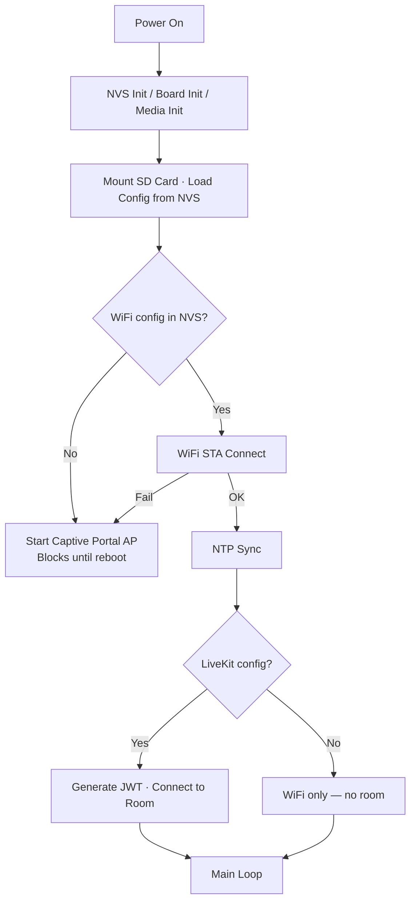

# Captive Portal Provisioning: Browser-Based Setup for LiveKit ESP32 Devices

Posts [01](../../01-custom-hardware-quickstart/blog/post.md) and [02](../../02-bsp-deep-dive/blog/post.md) got two-way audio working on the Waveshare ESP32-S3-Touch-LCD-1.83, but they share a major deficiency: every credential — WiFi SSID, WiFi password, LiveKit server URL, access token — is hardcoded in `sdkconfig.defaults`. If your WiFi password changes, you recompile. If your access token expires, you recompile. If you hand the device to someone on a different network, they need your entire toolchain just to type in an SSID.

That's fine for development, but it's a dead end for anything else.

This post replaces all of that with a **captive portal** — the same flow you've used to set up consumer WiFi gadgets. On first boot (or after a factory reset), the device starts its own WiFi access point. Connect from a phone or laptop, the browser auto-opens a setup page, you fill in credentials, and the device reboots into normal operation. No toolchain, no recompilation, no serial console.

This post also adds **on-device JWT generation**. Instead of pre-generating tokens that expire, the device takes an API key and API secret and mints a fresh access token every boot. Tokens are never stale, and you never need to recompile to refresh one.

An optional **SD card `env` file** lets you pre-fill the form for fleet provisioning — load an SD card with credentials, insert it, and the portal form is already populated when the user opens it.

The captive portal lives in a **reusable component** (`components/captive_portal/`) that you can drop into any ESP-IDF project. The blog walks through how to integrate it into a LiveKit application.

The code is in [`04-captive-portal-provisioning/code/`](../code/).

## What you'll need

Same hardware and tools as Posts 01–02:

- [Waveshare ESP32-S3-Touch-LCD-1.83](https://www.waveshare.com/esp32-s3-touch-lcd-1.83.htm).
- Small speaker with MX1.25 connector.
- ESP-IDF 5.4 or later ([install guide](https://docs.espressif.com/projects/esp-idf/en/stable/esp32s3/get-started/index.html)).
- [LiveKit Cloud](https://cloud.livekit.io) account (free tier works).
- USB-C cable.
- **Optional**: MicroSD card with an `env` file (details in Part 4).

What you **don't** need: `make_test_token.py`, pre-generated tokens, or WiFi credentials in your build config. The portal handles all of that at runtime.

## Part 1: How It Works

### Boot flow



### Captive portal mechanics

When the device has no WiFi config, it becomes a WiFi access point named something like `LiveKit-ESP-A3F7` (the suffix comes from the device's MAC address). Two services run simultaneously:

1. **DNS server** — Responds to *every* DNS query with `192.168.4.1` (the device's AP IP). This is what triggers the "sign in to network" popup on phones and laptops.
2. **HTTP server** — Serves an HTML form at `http://192.168.4.1/` with fields for WiFi credentials and LiveKit settings.

When the user submits the form:
1. The HTTP handler saves the values to NVS
2. The device reboots
3. On the next boot, it finds WiFi config in NVS and connects as a regular STA client

Subsequent boots skip the portal entirely — the device reads NVS, connects to WiFi, syncs NTP, generates a JWT, and joins the LiveKit room automatically.

### Factory reset

The portal page includes a "Factory Reset" button that erases all NVS config and reboots, returning the device to captive portal mode. This is handy for moving a device to a new network or changing LiveKit credentials.

## Part 2: The Reusable Captive Portal Component

The captive portal is a standalone ESP-IDF component with no dependencies on application-specific types. You can drop it into any project by copying the `components/captive_portal/` directory.

### Component structure

```
components/captive_portal/
├── CMakeLists.txt
├── Kconfig                     # AP channel, max connections
├── idf_component.yml           # depends on espressif/cJSON
├── include/
│   └── captive_portal.h        # public API
└── src/
    ├── portal_config.c          # NVS read/write
    ├── portal_ap.c              # Soft-AP + HTTP server + DNS
    ├── portal_page.h            # Embedded HTML form (C string)
    ├── portal_wifi.c            # WiFi STA with retry/backoff
    └── portal_env.c             # env file parser for SD card
```

### Public API

The header (`captive_portal.h`) exposes four groups of functions:

**NVS configuration** — Load, save, clear, and validate credentials stored in non-volatile storage:

```c
typedef struct {
    char wifi_ssid[64];
    char wifi_password[64];
    char lk_server_url[128];
    char lk_api_key[64];
    char lk_api_secret[256];
    char lk_room_name[64];
    char device_identity[64];
} portal_config_t;

esp_err_t portal_config_load(portal_config_t *cfg);
esp_err_t portal_config_save(const portal_config_t *cfg);
esp_err_t portal_config_clear(void);
bool portal_config_has_wifi(const portal_config_t *cfg);
bool portal_config_has_livekit(const portal_config_t *cfg);
```

**Captive portal** — Start and stop the soft-AP with HTTP/DNS servers:

```c
esp_err_t portal_start(const char *ap_name_prefix, const char *sd_mount_path);
bool portal_is_running(void);
esp_err_t portal_stop(void);
```

The `ap_name_prefix` parameter controls the AP SSID (e.g., "LiveKit-ESP" → "LiveKit-ESP-A3F7"). The `sd_mount_path` is optional — pass `NULL` if you don't have an SD card, or `"/sdcard"` to enable env file defaults.

**WiFi STA** — Connect to a network with exponential backoff:

```c
esp_err_t portal_wifi_init(void);
esp_err_t portal_wifi_connect(const char *ssid, const char *password);
bool portal_wifi_is_connected(void);
```

`portal_wifi_connect()` blocks until connected or failed (up to 10 retries with backoff, 60s timeout).

**SD card env loading** — Parse an env file and populate a config struct:

```c
esp_err_t portal_env_load(const char *base_path, portal_config_t *cfg);
```

### Key design decisions

**No global state.** The hey_livekit project this component was adapted from uses a global `g_ctx` struct for shared state. The captive portal component eliminates that dependency — all state is internal. You can use it in any project without adapting your application's architecture.

**Parameterized AP name.** Instead of hardcoding the AP SSID, `portal_start()` takes a prefix. Different projects get different device names on the network.

**Optional SD card.** The `sd_mount_path` parameter is nullable. Pass `NULL` and the env file feature is silently disabled. Pass a path and the `/status` endpoint overlays env file defaults onto the form fields.

### Using the component in your own project

1. Copy the `components/captive_portal/` directory into your project
2. Add `set(EXTRA_COMPONENT_DIRS components)` to your root `CMakeLists.txt`
3. Add `REQUIRES captive_portal` to your main component's `CMakeLists.txt`
4. Include `"captive_portal.h"` and use the API

## Part 3: Integration with LiveKit

### The new main.c

Here's the full boot flow in `main.c` — no `example_utils`, no `sandbox_token`, no hardcoded credentials:

```c
void app_main(void)
{
    // 1. Standard init
    nvs_flash_init();
    livekit_system_init();
    board_init();       // BSP — same as Post 02
    media_init();       // capture + render pipelines

    // 2. Try SD card
    const char *sd_mount_path = NULL;
    if (bsp_sdcard_mount() == ESP_OK) {
        sd_mount_path = BSP_SD_MOUNT_POINT;
    }

    // 3. Load config from NVS
    portal_config_t cfg = {0};
    portal_config_load(&cfg);

    // 4. No WiFi? → captive portal
    if (!portal_config_has_wifi(&cfg)) {
        // init WiFi subsystem for AP mode
        esp_netif_init();
        esp_event_loop_create_default();
        wifi_init_config_t wifi_cfg = WIFI_INIT_CONFIG_DEFAULT();
        esp_wifi_init(&wifi_cfg);
        portal_start("LiveKit-ESP", sd_mount_path);
        while (1) { vTaskDelay(pdMS_TO_TICKS(30000)); }
    }

    // 5. Connect WiFi
    portal_wifi_init();
    if (portal_wifi_connect(cfg.wifi_ssid, cfg.wifi_password) != ESP_OK) {
        portal_start("LiveKit-ESP", sd_mount_path);  // fallback
        while (1) { vTaskDelay(pdMS_TO_TICKS(30000)); }
    }

    // 6. NTP sync (required for JWT)
    sync_ntp();

    // 7. Generate JWT and connect to room
    if (portal_config_has_livekit(&cfg)) {
        join_room(&cfg);
    }

    // 8. Keep alive
    while (1) { vTaskDelay(pdMS_TO_TICKS(30000)); }
}
```

Compare this to Post 02's `main.c`, which called `lk_example_network_connect()` (a library function that reads WiFi credentials from Kconfig) and `join_room()` (which used pre-generated tokens from Kconfig). Here, the portal component handles WiFi, and JWT generation handles authentication — no Kconfig credentials needed.

### On-device JWT generation

Posts 01–02 used pre-generated tokens pasted into `sdkconfig.defaults`. These tokens have a fixed expiration time — when they expire, you recompile. That's the opposite of what you want for a device that should work unattended.

The JWT generator (`jwt_generator.c`) takes an API key and API secret and produces a signed access token on the device:

```c
jwt_params_t jwt_params = {
    .api_key    = cfg->lk_api_key,
    .api_secret = cfg->lk_api_secret,
    .room_name  = cfg->lk_room_name,
    .identity   = cfg->device_identity,
    .ttl_sec    = 600,  // 10-minute token
};
jwt_generate(&jwt_params, token, sizeof(token));
```

Under the hood:
1. Build a JSON header (`{"alg":"HS256","typ":"JWT"}`) and payload (issuer, subject, timestamps, video room grants)
2. Base64url-encode both
3. Sign with HMAC-SHA256 using the API secret (via mbedTLS, which is already in ESP-IDF)
4. Assemble: `header.payload.signature`

The token includes standard LiveKit video grants (room join, publish, subscribe, publish data). The device mints a fresh token every boot, so there's nothing to expire or refresh.

**Important:** JWT generation requires accurate system time for the `iat`/`exp`/`nbf` claims. That's why the boot flow syncs NTP before generating the token.

### What's removed

Compared to Posts 01–02, this project drops two LiveKit helper components:

| Component | What it did | Replaced by |
|-----------|-------------|-------------|
| `livekit/example_utils` | WiFi connect from Kconfig | `captive_portal` component |
| `livekit/sandbox_token` | Sandbox token generation | `jwt_generator.c` (on-device JWT) |

The `idf_component.yml` is simpler as a result:

```yaml
dependencies:
  idf: ">=5.4"
  livekit/livekit: "0.3.6"
  waveshare/esp32_s3_touch_lcd_1_83: "*"
  espressif/cJSON: "^1.0.0"
```

### A note on credential security

This example stores the API secret in plaintext in NVS and serves it back over the captive portal's local HTTP page. That keeps the example simple and minimizes integration points, but it means anyone with physical access to the device could extract the secret. Hardening credentials on embedded devices — encrypted NVS, secure boot, flash encryption — is a topic on its own and beyond the scope of this post. For production deployments, consult the [ESP-IDF Security Guide](https://docs.espressif.com/projects/esp-idf/en/stable/esp32s3/security/index.html).

## Part 4: SD Card Defaults

### The problem

The captive portal is great for one-off setup, but if you're configuring ten devices for the same office WiFi with the same LiveKit server, typing the same credentials ten times gets old fast.

### The solution: `env` files

Format a MicroSD card as **FAT32** (not exFAT or NTFS), then create a file called `env` (no extension) in the root directory:

```bash
# WiFi
WIFI_SSID="office-network"
WIFI_PASSWORD="hunter2"

# LiveKit
LIVEKIT_URL="wss://my-project.livekit.cloud"
LIVEKIT_API_KEY="APIkey123"
LIVEKIT_API_SECRET="secret456"
LIVEKIT_ROOM="esp32Room"
DEVICE_IDENTITY="office-speaker"
```

Insert the SD card and boot the device. When the captive portal opens, the form fields are **pre-filled** with the env file values. The user just reviews and clicks "Save & Reboot."

Key features of the env file parser:
- **Multiple filenames**: Tries `env` and `env.txt` (the `.txt` variant is for Windows users who can't create extensionless files).
- **Comments**: Lines starting with `#` are ignored.
- **Quotes**: Values can be optionally wrapped in single or double quotes.
- **`<RANDOM4>` placeholder**: In `LIVEKIT_ROOM`, `<RANDOM4>` is replaced with 4 random hex characters, giving each device a unique room name.
- **Non-destructive**: The env file values only pre-fill the form — they aren't committed to NVS until the user clicks "Save & Reboot."

### Factory provisioning workflow

1. Create an `env` file with your fleet defaults
2. Copy it to MicroSD cards
3. Insert a card into each device
4. Power on — the captive portal form is already filled out
5. Connect to the AP, verify the pre-filled values, click Save
6. Remove the SD card (it's only needed for initial setup)

### SD card initialization

The BSP handles SD card mounting with a single call:

```c
esp_err_t sd_err = bsp_sdcard_mount();
if (sd_err == ESP_OK) {
    sd_mount_path = BSP_SD_MOUNT_POINT;  // typically "/sdcard"
}
```

If there's no SD card or mounting fails, `sd_mount_path` stays `NULL` and the env file feature is silently disabled. No crash, no error — just a blank form.

## Part 5: Build, Flash, and Test

### 1. Build and flash

Since there are no secrets in `sdkconfig.defaults` — the portal handles all credentials at runtime — you can build straight away:

```bash
cd 04-captive-portal-provisioning/code
idf.py build
idf.py flash monitor
```

### 2. First boot — captive portal

On the serial monitor you'll see:

```
I (xxx) board: Initializing Waveshare ESP32-S3-Touch-LCD-1.83 (via BSP)
I (xxx) board: Board init complete (via BSP)
I (xxx) portal_config: No config namespace in NVS, starting unconfigured
I (xxx) main: No WiFi config found — starting captive portal
I (xxx) portal_ap: AP started: SSID='LiveKit-ESP-A3F7', IP=192.168.4.1
I (xxx) portal_ap: HTTP server started on port 80
I (xxx) portal_ap: DNS captive portal started on port 53
I (xxx) portal_ap: Captive portal ready — connect to 'LiveKit-ESP-A3F7' and open http://192.168.4.1
```

### 3. Configure the device

1. On your phone or laptop, connect to the WiFi network `LiveKit-ESP-XXXX`
2. A "sign in to network" popup should appear automatically
   - If it doesn't, open a browser and go to `http://192.168.4.1`
3. Fill in your WiFi SSID and password
4. Fill in your LiveKit Server URL, API Key, API Secret, and Room Name
5. Click **Save & Reboot**

### 4. Second boot — connected

The serial monitor now shows:

```
I (xxx) portal_config: Config loaded: WiFi=yes, LK=yes
I (xxx) main: WiFi config found, connecting...
I (xxx) portal_wifi: Connecting to 'your-wifi'...
I (xxx) portal_wifi: Connected, IP: 192.168.1.42
I (xxx) main: NTP synced, time=1710432000
I (xxx) jwt: JWT generated: 423 bytes, ttl=600s, room=my-room, identity=esp32-device
I (xxx) main: Connected to room 'my-room' at wss://your-project.livekit.cloud
```

Two-way audio works exactly as it did in Posts 01–02, but this time no credentials were compiled into the firmware.

### 6. Reconfiguring

To change WiFi or LiveKit settings:
1. Connect to the device's AP again (if you set up WiFi, you won't see the AP — the device is in STA mode)
2. To force the portal back: erase NVS with `idf.py erase-flash` and reflash, or add a reset button in your app that calls `portal_config_clear()` + `esp_restart()`
3. Or, while in portal mode, use the **Factory Reset** button on the web page

## Troubleshooting

| Symptom | Cause | Fix |
|---------|-------|-----|
| Captive portal popup doesn't appear | DNS server blocked by OS | Open `http://192.168.4.1` manually in your browser |
| "WiFi SSID and password required" error | Form validation failed | Make sure both WiFi fields are filled in |
| JWT generation fails ("time not set") | NTP sync failed | Check WiFi connection; make sure the device has internet access |
| WiFi connects but room connect fails | Wrong server URL or API key | Verify credentials in the LiveKit Cloud dashboard |
| SD card `env` not loading | File not found | Make sure the file is named `env` (no dot prefix) or `env.txt`; format the card as FAT32 |
| SD card mount fails (error 13) | No FAT32 filesystem | Format the MicroSD card as FAT32 (not exFAT); check that the card is firmly seated |
| "Long filenames disabled" warning at boot | BSP bug (cosmetic) | Ignore — the BSP checks a non-existent Kconfig macro. LFN is enabled and works correctly |
| Portal shows after WiFi config is saved | WiFi credentials are wrong | Connect to the AP again, check SSID spelling and password |

## What changed from Post 02

| Aspect | Post 02 | Post 04 |
|--------|---------|---------|
| WiFi credentials | `sdkconfig.defaults` | Captive portal (NVS) |
| LiveKit auth | Pre-generated token in Kconfig | On-device JWT from API key + secret |
| WiFi management | `livekit/example_utils` | `captive_portal` component |
| Token generation | `livekit/sandbox_token` or manual | `jwt_generator.c` (HMAC-SHA256) |
| Board init | BSP (same) | BSP (same) |
| Media pipeline | Same | Same |
| Recompile to change network? | Yes | No |

## What's next

The device now handles its own credentials — but you still need a serial cable to update firmware and a computer to flash it. Future posts tackle over-the-air updates, more advanced audio processing, and data channel communication.

The captive portal component is designed to be reusable. If you're building a different LiveKit ESP32 project, you can copy `components/captive_portal/` into your project and integrate it in a few lines of code.
