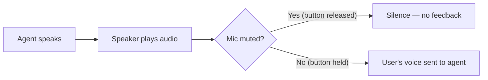
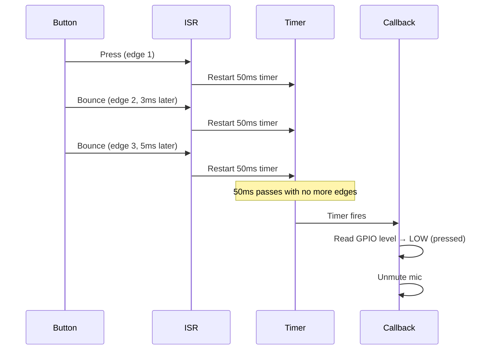

# Push-to-Talk Walkie-Talkie: GPIO Buttons and Audio Muting on LiveKit ESP32

Posts [01](../../01-custom-hardware-quickstart/blog/post.md) through [04](../../04-captive-portal-provisioning/blog/post.md) built up a fully provisioned LiveKit audio device: custom board support, BSP integration, captive portal configuration, and on-device JWT generation. But there's a problem we've been ignoring: **echo feedback**.

When the device talks to a LiveKit agent — a voice assistant, a meeting bot, anything that speaks back — the agent's audio plays through the device's speaker. The always-on microphone picks up that speaker output, sends it back to the agent, and the agent hears itself. It responds to its own words, which play through the speaker again, and the loop continues until someone pulls the plug. This is the echo-feedback problem, and it makes always-on audio unusable for agent interaction without echo cancellation.

The simplest fix is **push-to-talk (PTT)**: the microphone stays muted until you press and hold a button. The agent speaks freely through the speaker. When you want to respond, hold the button, talk, release. The agent never hears its own output because the mic was off while it was speaking.

PTT also enables a second use case: **device-to-device walkie-talkie**. Flash the same firmware onto two ESP32 boards, put them in the same LiveKit room, and they can talk to each other — hold the button to transmit, release to listen.

Post 06 will add proper Acoustic Echo Cancellation (AEC) for hands-free, full-duplex audio. But PTT is simpler, works on any hardware, and is useful in its own right. It's also only about 120 lines of new code on top of Post 04's foundation.

The code is in [`05-walkie-talkie-ptt/code/`](../code/).

## What you'll need

Same hardware and tools as Posts 01–04:

- [Waveshare ESP32-S3-Touch-LCD-1.83](https://www.waveshare.com/esp32-s3-touch-lcd-1.83.htm)
- Small speaker with MX1.25 connector
- ESP-IDF 5.4 or later ([install guide](https://docs.espressif.com/projects/esp-idf/en/stable/esp32s3/get-started/index.html))
- [LiveKit Cloud](https://cloud.livekit.io) account (free tier works)
- USB-C cable
- **Optional**: A second Waveshare board for walkie-talkie mode
- **Optional**: MicroSD card with an `env` file (same as Post 04)

## Part 1: The Echo Problem and How PTT Solves It

### The feedback loop


Without echo cancellation, this loop runs continuously. The agent responds to its own words, which generates more audio, which the mic captures again. The conversation becomes unintelligible within seconds.

### PTT breaks the loop



With PTT, the microphone is muted by default. The agent can speak freely through the speaker without any risk of feedback. When you hold the button, the mic unmutes, you talk, and the agent hears your voice. When you release, the mic mutes again.

### Hardware muting vs. server-side muting

The LiveKit protocol supports a `MuteTrackRequest` message that tells the server a track is muted. However, the ESP32 SDK doesn't expose this as a public API yet. Instead, we mute at the **codec level** using `esp_codec_dev_set_in_mute()`:

```c
esp_codec_dev_set_in_mute(record_handle, true);   // Mute mic
esp_codec_dev_set_in_mute(record_handle, false);  // Unmute mic
```

This silences the ADC input on the ES7210 microphone codec. The I2S stream keeps running (no start/stop overhead), the AEC reference channel stays active, and the Opus encoder sends near-silent frames that consume minimal bandwidth thanks to DTX (Discontinuous Transmission).

The trade-off: other participants in the room see the audio track as "active" even when the mic is muted. For a walkie-talkie or agent interaction, this is perfectly acceptable.

## Part 2: The Boot Button as PTT Input

### GPIO0 on ESP32-S3

Every ESP32-S3 development board has a **boot button** wired to GPIO0. On the Waveshare ESP32-S3-Touch-LCD-1.83, GPIO0 is not used by the BSP (which claims GPIOs 1–16, 38–40, and 45–46 for I2C, I2S, SPI, LCD, and SD card). That makes it a free GPIO we can use for PTT with no conflicts.

The boot button is **active-low**: pressing it pulls GPIO0 to ground; releasing it lets the internal pull-up resistor bring it back to 3.3V. We configure the GPIO with `GPIO_INTR_ANYEDGE` to trigger an interrupt on both press (falling edge) and release (rising edge).

### Debouncing

Mechanical buttons don't produce clean edges. When you press a button, the contacts bounce — rapidly opening and closing for a few milliseconds before settling. Without debouncing, a single press could trigger dozens of interrupts.

We handle this with a 50 ms one-shot timer:



Each bounce restarts the timer. Only after the button settles for 50 ms does the timer fire and read the actual state. This guarantees clean, single state transitions.

### ISR safety

The interrupt service routine (ISR) runs in a restricted context — no memory allocation, no logging, no FreeRTOS API calls. Our ISR does the absolute minimum: stop the timer and restart it. All real work happens in the timer callback, which runs in the timer task context with full API access.

```c
static void IRAM_ATTR gpio_isr_handler(void *arg)
{
    esp_timer_stop(s_debounce_timer);
    esp_timer_start_once(s_debounce_timer, DEBOUNCE_US);
}
```

The `IRAM_ATTR` attribute places the function in internal RAM so it can execute even when flash is being accessed.

### The PTT module

The PTT logic lives in a standalone module (`ptt.h` / `ptt.c`) that depends only on the codec handle — it has no knowledge of LiveKit, rooms, or network state:

**`ptt.h`**:
```c
typedef enum {
    PTT_STATE_IDLE,     // Muted — not transmitting
    PTT_STATE_TALKING   // Unmuted — button held, transmitting
} ptt_state_t;

esp_err_t ptt_init(esp_codec_dev_handle_t record_handle);
void ptt_cleanup(void);
ptt_state_t ptt_get_state(void);
```

**`ptt.c`** — the debounce callback:
```c
static void debounce_cb(void *arg)
{
    bool released = (gpio_get_level(PTT_BUTTON_GPIO) == 1);

    if (released == s_last_button_state) {
        return;  // No change — ignore
    }
    s_last_button_state = released;

    if (!released) {
        // Button pressed → unmute mic
        s_ptt_state = PTT_STATE_TALKING;
        esp_codec_dev_set_in_mute(s_record_handle, false);
        ESP_LOGI(TAG, "PTT: Talking (mic unmuted)");
    } else {
        // Button released → mute mic
        s_ptt_state = PTT_STATE_IDLE;
        esp_codec_dev_set_in_mute(s_record_handle, true);
        ESP_LOGI(TAG, "PTT: Idle (mic muted)");
    }
}
```

The GPIO pin is configurable via `menuconfig` → "LiveKit Example" → "PTT button GPIO number" (default: GPIO0). If you're using a board with the boot button on a different pin, change it there.

## Part 3: Integrating PTT into the Application

### What changed from Post 04

The boot flow is identical to Post 04 — captive portal, WiFi, NTP, JWT, room connection. The only changes are in `main.c`:

**1. PTT init on room connect.** We initialize PTT in the room state callback, not in `app_main()`. This ensures the audio pipeline is running before we start muting:

```c
static void on_room_state_changed(livekit_connection_state_t state, void *ctx)
{
    ESP_LOGI(TAG, "Room state changed: %s", livekit_connection_state_str(state));

    if (state == LIVEKIT_CONNECTION_STATE_CONNECTED) {
        esp_err_t err = ptt_init(get_record_handle());
        if (err == ESP_OK) {
            ESP_LOGI(TAG, "PTT ready — press and hold BOOT button to talk");
        }
    }
}
```

**2. PTT state in the main loop.** The keep-alive log now reports whether the mic is active:

```c
const char *ptt_str = (ptt_get_state() == PTT_STATE_TALKING)
                      ? "TALKING" : "IDLE";
ESP_LOGI(TAG, "Running (heap: %lu bytes free, PTT: %s)",
    (unsigned long)esp_get_free_internal_heap_size(), ptt_str);
```

**3. New source file.** `ptt.c` is added to `main/CMakeLists.txt`:

```cmake
idf_component_register(SRCS "main.c" "board.c" "media.c" "jwt_generator.c" "ptt.c"
                      INCLUDE_DIRS "."
                      REQUIRES captive_portal
                      PRIV_REQUIRES mbedtls json tempotian__media_lib_sal)
```

That's it. The captive portal, board init, media pipelines, JWT generator, and all build configuration carry over from Post 04 unchanged.

### File diff summary

| File | Change from Post 04 |
|------|---------------------|
| `main/ptt.c`, `main/ptt.h` | **New** — PTT button module |
| `main/main.c` | Added `#include "ptt.h"`, PTT init in room callback, PTT state in main loop |
| `main/CMakeLists.txt` | Added `ptt.c` to SRCS |
| `main/Kconfig.projbuild` | Added `CONFIG_PTT_BUTTON_GPIO` |
| `sdkconfig.defaults` | Added `CONFIG_PTT_BUTTON_GPIO=0` |
| `CMakeLists.txt` | Project name → `lk_walkie_talkie` |
| Everything else | Unchanged |

## Part 4: Build, Flash, and Test

### 1. Build and flash

```bash
cd 05-walkie-talkie-ptt/code
idf.py build
idf.py flash monitor
```

### 2. First boot — captive portal

If this is a fresh device (or you erased flash), the captive portal starts. Connect to the device's AP (e.g., `LiveKit-ESP-558D`), open a browser, and enter your WiFi + LiveKit credentials. See [Post 04](../../04-captive-portal-provisioning/blog/post.md) for details.

### 3. Second boot — PTT mode

After saving credentials, the device reboots and connects automatically:

```
I (xxxx) main: WiFi config found, connecting...
I (xxxx) main: NTP synced, time=1710432000
I (xxxx) main: LiveKit config found — generating JWT and connecting...
I (xxxx) main: Connected to room 'my-room' at wss://my-project.livekit.cloud
I (xxxx) main: Room state changed: Connected
I (xxxx) ptt: PTT initialized on GPIO0 (press and hold to talk)
I (xxxx) main: PTT ready — press and hold BOOT button to talk
```

### 4. Test PTT

Press and hold the boot button:
```
I (xxxx) ptt: PTT: Talking (mic unmuted)
```

Release:
```
I (xxxx) ptt: PTT: Idle (mic muted)
```

To verify audio is flowing, open [LiveKit Meet](https://meet.livekit.io) in a browser and join the same room. Hold the boot button on the ESP32, speak into the mic — you should hear audio in the browser. Release the button and speak again — silence in the browser.

## Part 5: Multi-Device Walkie-Talkie

Flash the same firmware onto a second Waveshare board. Configure each device via the captive portal:

- **Device 1**: Identity = `walkie-1`, Room = `walkie-room`
- **Device 2**: Identity = `walkie-2`, Room = `walkie-room`

Both devices join the same room. Hold the boot button on device 1 and speak — device 2 plays the audio through its speaker. Switch roles: hold the button on device 2 to talk back.

Both devices *can* transmit simultaneously — this isn't true half-duplex radio. But the PTT pattern naturally encourages turn-taking, just like a real walkie-talkie.

## Part 6: What About a PTT LED?

The `ptt_minimal` reference app used GPIO2 as a PTT indicator LED. On the Waveshare board, GPIO2 is the SD card clock (`BSP_SD_CLK`) — using it for an LED would break SD card support.

Options for visual feedback:

1. **Console logs** (this post) — simple, no hardware conflicts
2. **The 1.83" LCD** — render a PTT status indicator on the touch display (requires LVGL, covered in a later post)
3. **External LED** — wire an LED to any free GPIO and change `CONFIG_PTT_BUTTON_GPIO` in menuconfig

The Kconfig option makes the GPIO configurable, so readers using boards with dedicated LED pins can add visual feedback without modifying code.

## Troubleshooting

| Symptom | Cause | Fix |
|---------|-------|-----|
| No audio when button pressed | Mic not initialized | Check that the room connected before pressing (look for "PTT initialized" in logs) |
| Button press not detected | Wrong GPIO | Verify `CONFIG_PTT_BUTTON_GPIO` matches your board's boot button pin |
| Rapid press/release events | Debounce too short | Increase `DEBOUNCE_US` in `ptt.c` (default 50 ms is usually sufficient) |
| Echo feedback despite PTT | Button stuck or held | Release the button fully; check for mechanical issues |
| Agent hears itself | Button held while agent speaks | Release the button before the agent responds |
| Captive portal issues | See Post 04 | [Post 04 troubleshooting](../../04-captive-portal-provisioning/blog/post.md#troubleshooting) |

## What changed from Post 04

| Aspect | Post 04 | Post 05 |
|--------|---------|---------|
| Mic state | Always on | Muted by default (PTT) |
| Boot button | Unused | Push-to-talk trigger |
| New files | — | `ptt.c`, `ptt.h` |
| Echo handling | None (problem ignored) | PTT prevents feedback |
| Use case | Always-on audio | Walkie-talkie / agent interaction |
| Captive portal | Same | Same (reused) |
| Board init | Same | Same (reused) |
| Media pipeline | Same | Same (reused) |

## What's next

PTT works, but it's a workaround — you have to hold a button every time you want to speak. Post 06 adds **Acoustic Echo Cancellation (AEC)**, which lets the device cancel the speaker's output from the microphone input in real time. With AEC, you get full-duplex, hands-free audio — no button needed. The device can listen and speak simultaneously without feedback loops.
